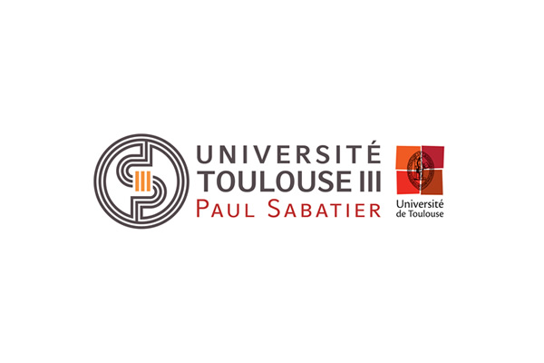
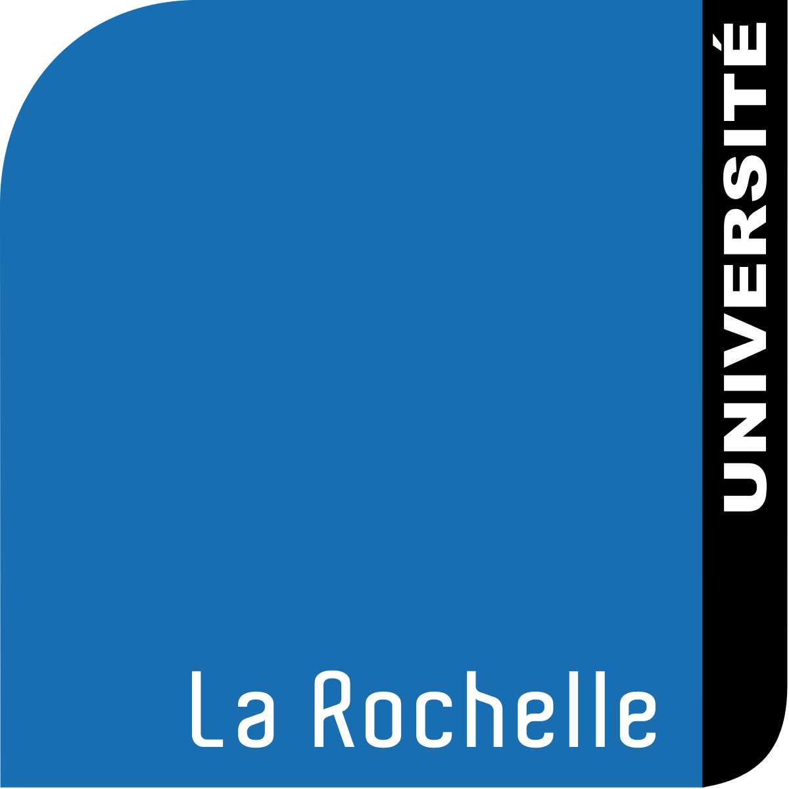

### Master Thesis in Artificial Intelligence

**Computer Science / Mathematic Faculty**

*Supervisor: Prof. Jonathan Lawry*

I did my thesis at the University of Bristol for six months where I worked on a mathematical framework to use vagueness in machine learning. 

---

### Master Degree in Artificial Intelligence

**Computer Science / Mathematic Faculty**

With Honors - September 2016

I study how to write software to develop using artificial intelligence algorithms such Machine Learning, symbolic AI or multi-agent systems. I learned how to apply artificial intelligence to real problems addressing  strategic decision-making and augment business performance.

---

### Bachelor Degree in Computer Science

**Computer Science Faculty**

With High Honors - September 2014

I study the fundamentals of Computer science to develop a professional skills to develop software from their administration to their conception and deployment.

---